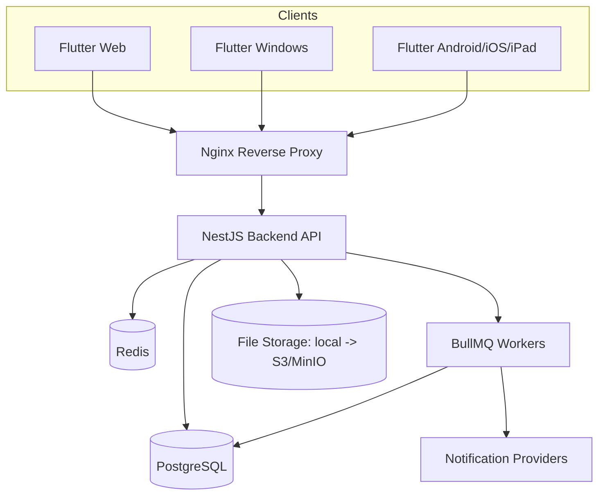
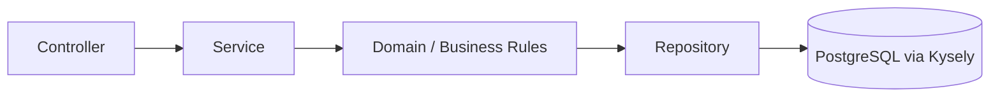
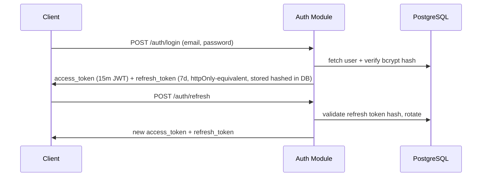

# Architecture Overview

## Stack Decisions

| Concern | Choice | Reason |
|---|---|---|
| Backend framework | NestJS (TypeScript) | Modular DI architecture maps 1:1 onto the module list (auth, organizations, products, inventory, ...); first-class guards/interceptors for tenant isolation & RBAC; built-in Swagger. |
| Database access | Raw SQL via [Kysely](https://kysely.dev) (type-safe query builder) + `pg` driver | Ledger/stock mutations need explicit `SELECT ... FOR UPDATE` row locking and hand-tuned transactions; an ORM would obscure this. Kysely gives compile-time-checked SQL without hiding the query. |
| Migrations | `node-pg-migrate` | Plain SQL/JS migrations, no ORM lock-in, works with any future access layer. |
| Cache/queues | Redis (ioredis) + BullMQ | Background jobs (notifications, webhooks, forecasting) and caching. |
| Frontend | Flutter (Windows, Web, Android, iOS, iPad) | Single codebase, responsive breakpoints. |
| State management | Riverpod | Compile-safe DI, testable, no BuildContext coupling, single consistent approach app-wide. |
| Local/offline DB | Drift (SQLite) | Typed local schema + sync queue table for offline mobile. |
| Reverse proxy (prod) | Nginx | TLS termination, static Flutter web hosting, API proxy. |

## System Diagram

## Backend Module Layering

Controllers: HTTP concerns only (DTO validation, auth guard, response shaping).
Services: orchestrate use cases, transactions.
Domain: pure business rules (e.g. stock availability calculation).
Repository: Kysely queries, no business logic.

## Multi-Tenancy

Row-level tenant isolation: every tenant-owned table has `organization_id UUID NOT NULL REFERENCES organizations(id)`.
A NestJS `TenantGuard` + request-scoped `TenantContext` injects the authenticated user's `organization_id` into every repository call. Repositories require an explicit `organizationId` parameter — there is no "global" query method — so cross-tenant leakage requires an explicit code change, not an omission.

## Auth Flow

## Phase Status

- [x] Phase 0: Repository audit (empty repo)
- [x] Phase 1: Architecture docs (this document + database.md, api.md, development-plan.md)
- [ ] Phase 2: Foundation (docker, db, backend auth/org/users/roles, flutter skeleton) — in progress
- [ ] Phase 3+: see development-plan.md
