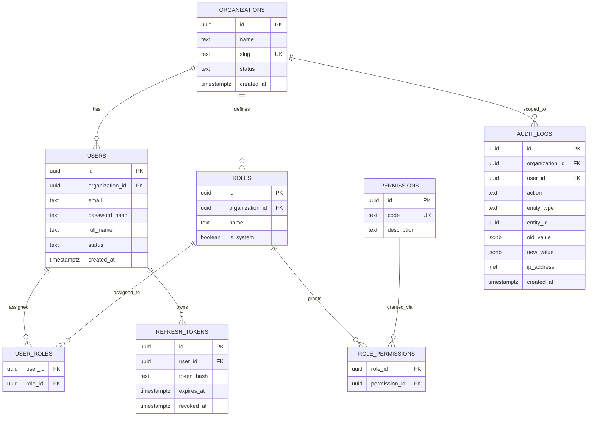

# Database Design (Foundation Phase)

PostgreSQL. UUID PKs (`gen_random_uuid()` via `pgcrypto`). All tenant tables carry `organization_id`. All tables carry `created_at`, `updated_at`; mutable business tables carry `deleted_at` for soft delete.

## Core Tables (Phase 2 — Foundation)

Notes:
- `email` is unique per organization (`UNIQUE(organization_id, email)`), not globally — a user's login is looked up by email + org context via an `org_id` claim resolved at login (email uniqueness across the whole platform is intentionally NOT enforced, since two unrelated tenants may share a user's email).
- `permissions` is a global catalog (`product.view`, `inventory.adjust`, etc. — see master spec §8); `role_permissions` links per-organization roles to that catalog.
- `audit_logs` rows are insert-only; no UPDATE/DELETE grants at the DB-role level in production.
- Future phases (products, inventory, warehouses, ...) each get their own `docs/*.md` section and migration files; this file will be extended per-phase rather than rewritten.

## Inventory Core Tables (Phase 3)

Added in `database/migrations/..._inventory_core.js`: `units`, `unit_conversions`, `categories` (self-referencing for subcategories), `brands`, `warehouses`, `locations` (self-referencing), `products`, `product_variants` (attributes as JSONB — the one deliberate use of JSONB here, since variant attributes are genuinely admin-configurable per §26 of the master spec), `batches`, `serial_numbers`, `stock_ledger`, `stock_balances`.

See `docs/inventory-engine.md` for the ledger/balance design and why `stock_balances` uses a nil-UUID sentinel instead of `NULL` for optional dimensions.

## Procurement Tables (Phase 4)

Added in `database/migrations/..._procurement.js`: `suppliers`, `purchase_orders` + `purchase_order_items`, `goods_receipts` + `goods_receipt_items`, `purchase_returns` + `purchase_return_items`. Goods receipts and purchase returns never touch `stock_balances`/`stock_ledger` directly — they call into `InventoryService` (see docs/inventory-engine.md), so procurement and the inventory engine can't drift out of sync. See docs/purchasing.md for the PO status lifecycle.

## Sales Tables (Phase 5)

Added in `database/migrations/..._sales.js`: `customers`, `sales_orders` + `sales_order_items` (with `quantity_ordered`/`quantity_reserved`/`quantity_dispatched` tracked per line, mirroring `purchase_order_items`' `quantity_ordered`/`quantity_received`), `sales_dispatches` + `sales_dispatch_items`, `sales_returns` + `sales_return_items`. Like procurement, none of these write to `stock_balances`/`stock_ledger` directly — see docs/sales.md and docs/inventory-engine.md "Reservations".

## Reports (Phase 6)

No new tables — every report query reads the tables from Phases 3–5 directly. See docs/reports.md.

## Configuration Tables (Phase 7)

Added in `database/migrations/..._configuration.js`: `custom_field_definitions` + `custom_field_values` (entity-agnostic — `entity_type` is a plain string, not an FK, so any entity can have custom fields defined for it without a migration), `tax_categories` + `tax_rates` (plus `products.tax_category_id`), `price_lists` + `price_list_items`, `notifications`, `purchase_approval_rules`. See docs/configuration.md, docs/workflows.md, docs/notifications.md.

## Mobile/Offline Tables (Phase 8)

Added in `database/migrations/..._mobile_offline.js`: `stock_counts` + `stock_count_lines` (approval posts through `InventoryService`, per usual), `idempotency_keys` (caches a write's response per `(organization, key, route)` for safe client retries — see docs/mobile-offline.md).

## POS, Webhooks, Integrations, Subscriptions (Phase 9)

Added in `database/migrations/..._pos_webhooks_integrations.js`: `pos_registers`, `pos_sessions`, `pos_sales` + `pos_sale_items` + `pos_sale_payments` (POS sales post through `InventoryService` immediately, per usual — see docs/pos.md); `webhook_subscriptions` + `webhook_deliveries`; `integration_connections` (abstraction only — see docs/integrations.md); `subscriptions` (one row per organization, lazily created).

## Migration Tooling

`node-pg-migrate`, plain `.sql`-style JS migrations under `database/migrations`. Run via `npm run migrate:up` / `migrate:down` in `backend/`.
