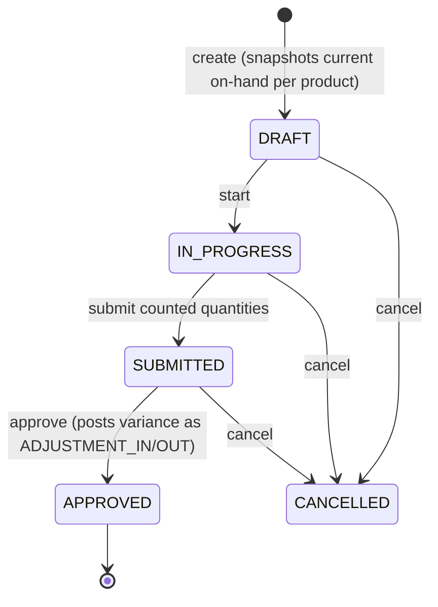

# Mobile Warehouse Operations & Offline (Phase 8)

## Stock Counting

Deferred from Phase 3, implemented here because it's the clearest "mobile warehouse operation" — walking a warehouse with a phone, counting bins.

`system_quantity` is snapshotted onto each `stock_count_line` at creation time and never recomputed — a count reflects what the books said *at count time*, even if other transactions post against the same product afterward. `submit` can be called multiple times with different subsets of lines (a warehouse worker counting one aisle, then another), and `approve` posts one `ADJUSTMENT_IN`/`ADJUSTMENT_OUT` movement per line with a non-zero variance through `InventoryService` — never writes `stock_balances` directly, same rule as every other module.

Supports `FULL` (every product) or `CYCLE` (a specific product subset) counts via `productIds` on creation.

## Barcode Scanning

`GET /products/barcode/:code` checks the product's own `barcode` first, then falls back to any variant's `barcode`. See docs/flutter.md "Offline & Barcode Scanning" for the client side.

## Idempotency

Per master spec §81. `IdempotencyInterceptor` (`backend/src/common/idempotency.interceptor.ts`) is applied to `POST /inventory/opening-stock`, `/adjustments`, `/transfers`, and `POST /stock-counts/:id/submit`/`/approve` — the write endpoints a mobile client is most likely to retry after a dropped connection. A client sends an `Idempotency-Key` header (any client-generated unique string, e.g. a UUID); if that exact `(organization, key, route)` already produced a response, the stored response is replayed instead of re-running the handler. No header = no protection, request runs normally — this is opt-in, matching how the Flutter offline queue (below) uses it, not a requirement on every caller.

## Offline Sync

See docs/flutter.md "Offline & Barcode Scanning" for the client-side `LocalDatabase`/`SyncService` design (Drift-backed queue, idempotency-keyed replay, stops at the first real conflict rather than guessing how to resolve it).

## Not yet implemented

- No screen currently queues a write into the offline `SyncQueueEntries` table — the queue/replay/idempotency machinery is built and unit-tested, but mobile receiving/picking/cycle-count-entry screens that would actually use it don't exist yet (Flutter shipped read-list screens: Products, Suppliers, Customers, Dashboard, plus the barcode lookup screen).
- No connectivity-change listener to trigger `syncPending()` automatically — it would need to be called explicitly (e.g. a "Sync now" button, or wired to `connectivity_plus`) once a queuing screen exists.
- No conflict-resolution UI for a `FAILED` queue entry — today it just sits there with `lastError` populated for a developer to inspect via the local database; a real UI would need to show the user "this stock count line couldn't be adjusted, stock changed underneath you — retry or discard."
