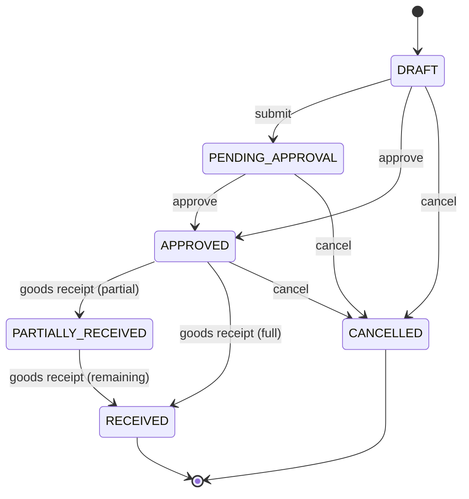

# Purchasing (Phase 4)

## Purchase Order lifecycle

A full approval-threshold workflow engine (per master spec §25 — amount thresholds, multi-level approvers, escalation) is **not** implemented; `submit`/`approve`/`cancel` are simple status transitions gated by the `purchase.create`/`purchase.approve` permissions. The configurable workflow engine is deferred to Phase 7.

## Goods Receipt

`POST /purchase-orders/:id/goods-receipts` — the only way stock enters via procurement. For each line it:
1. Validates the line belongs to that PO and the received quantity doesn't exceed what's still outstanding (`quantity_ordered - quantity_received`) — rejects with `409 OVER_RECEIPT` otherwise.
2. Records a `goods_receipt_items` row (optionally tagged with a `batch_id` for batch-tracked products).
3. Posts a `PURCHASE_RECEIPT` movement through `InventoryService.postMovementInTrx` in the **same database transaction**, so the receipt record and the stock increase are atomic — a failure partway through rolls back both.
4. Updates the PO's `quantity_received` per line and flips its status to `PARTIALLY_RECEIVED` or `RECEIVED` once every line is fully received.

Partial receipts are fully supported — a PO can be received across multiple goods receipts over time.

## Purchase Returns

`POST /purchase-returns` posts a `RETURN_OUT` movement per line (optionally against a specific batch), decreasing stock. Not yet linked to a supplier credit/refund workflow — that arrives with the accounting/payments area, out of scope for the current phases.

## Not yet implemented

Purchase Requests and RFQ/Supplier Quotation stages (master spec §18) are not built — the flow currently starts directly at Purchase Order. Supplier-specific pricing and backorder tracking are deferred to Phase 5/6 alongside Sales and Reporting, where they're needed together.
