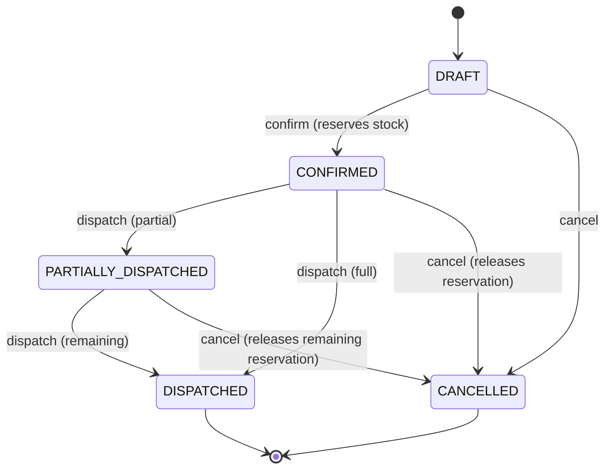

# Sales (Phase 5)

## Sales Order lifecycle

Mirrors the purchase order lifecycle (docs/purchasing.md) with one addition: **confirming** a sales order reserves stock rather than moving it. Reservation only narrows what's *available* (`on_hand - reserved`) — it does not touch `on_hand` or write a `stock_ledger` row (see docs/inventory-engine.md "Concurrency" and "What's deferred").

## Reservation and dispatch

- `POST /sales-orders/:id/confirm` — for every line, calls `InventoryService.reserveInTrx()`, which row-locks the same `stock_balances` slot `postMovement` uses and rejects with `409 INSUFFICIENT_STOCK` if the line can't be fully reserved. All lines reserve in one transaction — a sales order is never partially confirmed.
- `POST /sales-orders/:id/dispatches` — fulfils a reservation: posts a `SALES_ISSUE` movement (decreasing `on_hand`) *and* releases the matching amount of `reserved`, in the same transaction, so the two numbers can never drift apart. Rejects over-dispatch (`409 OVER_DISPATCH`) the same way goods receipt rejects over-receipt. Partial dispatch is supported, moving the order to `PARTIALLY_DISPATCHED` until every line is fully dispatched.
- `POST /sales-orders/:id/cancel` — releases whatever reservation hasn't yet been dispatched.

Picking and packing (master spec §19: `Picking → Packing → Dispatch`) are not modeled as separate statuses/documents — dispatch is the single fulfillment step for now. Adding them back in as distinct stages (with their own staff assignment/scanning workflow) is a warehouse-operations follow-up once Phase 8 (mobile/offline) is in scope.

## Sales Returns

`POST /sales-returns` posts a `RETURN_IN` movement per line, increasing stock — mirrors purchase returns.

## Not yet implemented

Quotations (pre-order stage), customer-specific pricing, credit-limit enforcement against `customers.credit_limit` (the column exists; nothing reads it yet), and backorder tracking when a line can't be fully reserved. See docs/development-plan.md for what's coming in Phase 6/7.
