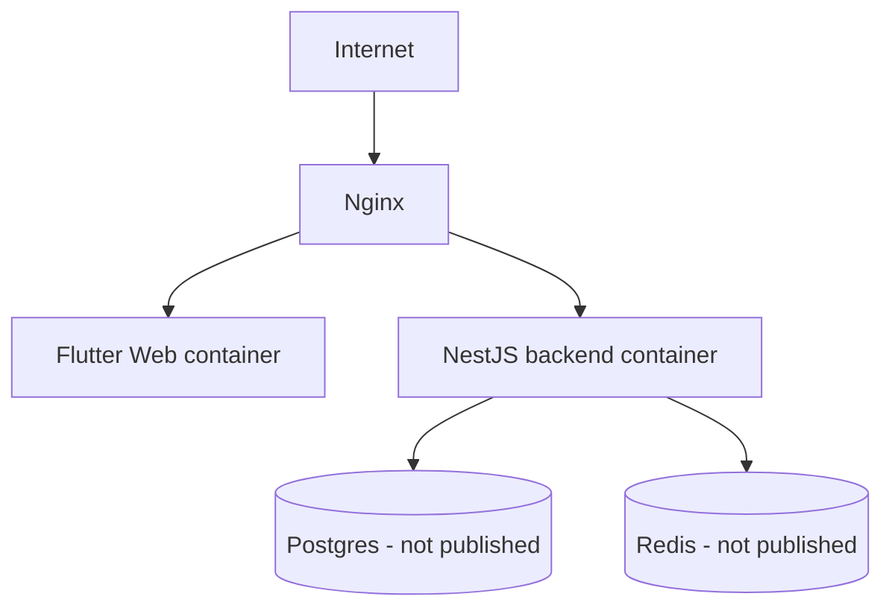

# VPS Deployment (Linux, Docker Compose)

## Steps

1. Provision a Linux VPS with Docker + Docker Compose installed.
2. Clone the repo, copy `.env.example` -> `.env.production`, fill in strong secrets (`JWT_SECRET`, DB password).
3. Build the Flutter web release once and place it where `flutter_app/Dockerfile.web` expects it, or build in CI and push the image.
4. `docker compose -f docker-compose.prod.yml up -d --build`.
5. Point DNS at the VPS; obtain a TLS certificate (certbot) into `nginx/certs`, then extend `nginx/nginx.conf` with the HTTPS server block described inline in that file.
6. Run migrations: `docker compose -f docker-compose.prod.yml exec backend npm run migrate:up`. Do **not** run `npm run seed` in production.

Postgres and Redis are never published to a host port in `docker-compose.prod.yml` — only reachable by other containers on the compose network.

See docs/backup-restore.md (to be added alongside Phase 3, once real transactional data exists) for backup strategy.
