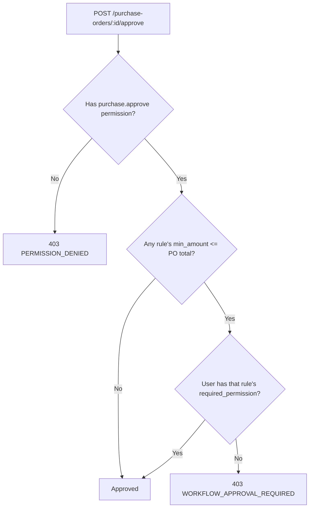

# Workflow Engine (Phase 7)

The master spec (§25) describes a fully configurable approval workflow: triggers, conditions, multi-level approvers, department/role scoping, escalation, notifications. What's implemented is a deliberately narrower slice of that: **amount-threshold purchase order approval**, because it's the one workflow concretely referenced elsewhere in the spec ("Purchase > ₹100,000 → Manager Approval → Finance Approval") and it's the only one with a real caller (`PurchasingService.approvePurchaseOrder`) today.

## Model

`purchase_approval_rules`: `name`, `min_amount`, `required_permission` (defaults to `purchase.approve`). Multiple rules can exist at different thresholds — the highest `min_amount` at or below the PO's total is the one that applies, so a ₹150,000 PO under a ruleset with both a ₹10,000-Manager rule and a ₹100,000-Finance rule requires the Finance permission specifically, not just the baseline Manager one.

## Enforcement

The `purchase.approve` permission on the `POST /purchase-orders/:id/approve` route (checked by `PermissionsGuard`, per docs/authorization.md) is the **baseline** gate — anyone without it can't even reach the service method. `WorkflowService.canApprovePurchaseOrder()` is then a **second**, dynamic check inside `PurchasingService`: it resolves the applicable rule for the PO's total and verifies the approving user holds that rule's specific `required_permission`, rejecting with `403 WORKFLOW_APPROVAL_REQUIRED` if not. No rule matching the PO's amount means the baseline permission is sufficient — thresholds are opt-in per organization, not a forced extra step by default.

## Not yet implemented

Multi-level approval chains (Manager *then* Finance, both required in sequence — today it's "whichever single permission the matching rule names"), department/branch/warehouse-scoped rules, escalation on timeout, and applying the same threshold pattern to Sales Orders or any entity besides Purchase Orders. The `WorkflowService` is structured so a Sales equivalent (`sales_approval_rules`) could be added the same way without touching `PurchasingService`.
